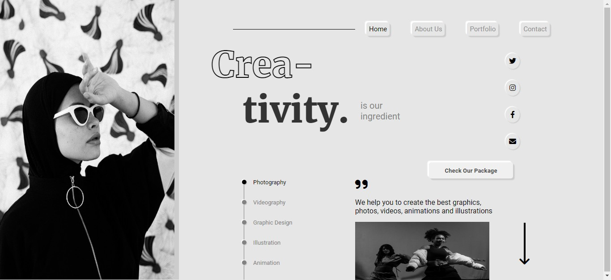

# Visual-Designer-Portfolio  

This is basically a one pager template project made in HTML/CSS with creativity for an imaginary creatve designer on the internet.

##   preview

## 🛠 Technologies Used
  - HTML - Hyper Text Markup Language
  - CSS - Cascadeing Spread Sheet
  - CSS Absolute Positioning

 
 !! And Note that I haven't made it responsive it only works in laptop screen if you are useing desktop it won't work as the whole project is based on absolute positioning.
 